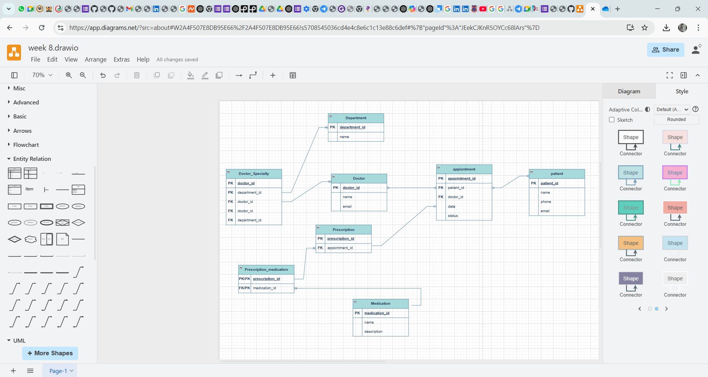

# week-8-assignment
# 🏥 Clinic Booking Database

## 📌 Description
A **MySQL-based booking system** for managing patient records, doctor appointments, and prescriptions.

## ⚙️ Setup Instructions
1. Clone the repository:https://github.com/Bella-winter/week-8-assignment.git
2. **Import the database**: Use `clinic_db.sql` to set up MySQL tables.
3. **Run the API**:
- FastAPI (Python): `uvicorn main:app --reload`
- Express.js (Node.js): `node server.js`

## 🗂️ ER Diagram

## 🔗 API Endpoints
| Method | Endpoint | Description |
|--------|---------|------------|
| GET | `/patients` | Retrieve all patients |
| POST | `/patients` | Add a new patient |
| PUT | `/patients/{id}` | Update patient info |
| DELETE | `/patients/{id}` | Remove patient record |

## 🧠 Database Structure
File: `clinicbookingdb.sql` (Contains **tables, relationships, and sample data**).

## 💻 Backend API
Folder: `/api/`  
Contains **Python (FastAPI) ** backend logic for CRUD operations.

